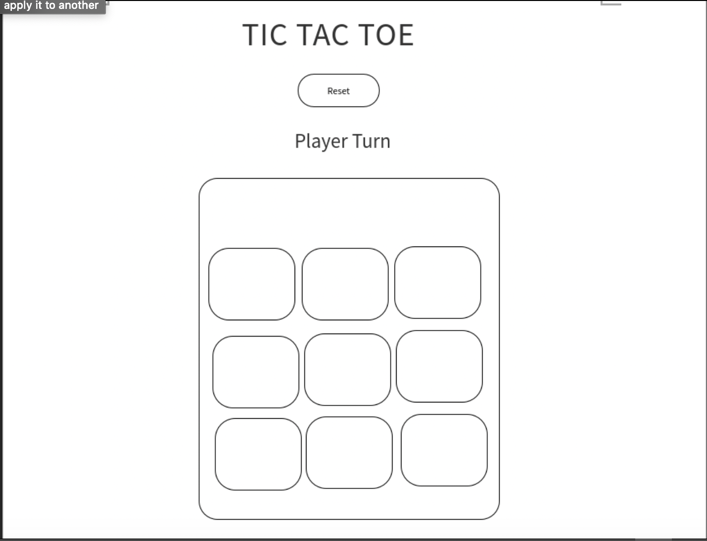

# TIC TAC TOE

# User Story
* Game will have two player, player x and player o
* The container will have in total of 9 spaces to play with
* to start the game the player x, will just need to click any of the available square to mark the x symbol to it
* after player x marked will be the player o turn
* player o turn also just need to click into the available square to mark the o symbol to it.
* player won't be able to click the same that is marked down
* if the player x can get 3 consecutive line before the player o, player x  will be announced as the winner.
* if the player o can get 3 consecutive line before the player x, player o will be announced as the winner.
* if there is no space available and no player got 3 symbol connected, the game will be announced as tie.
* after winning the game, tie or to re-play the game, player just need to click the reset button.
* reset button will reset the game and player can play again
* Enjoy !