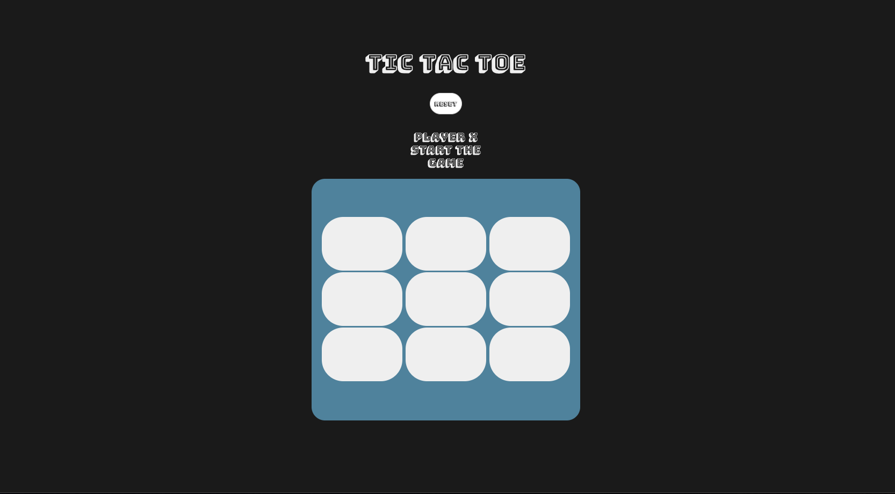

# TIC TAC TOE

Tic Tac Toe a basic and classic game that everyone has played when they were kid. 

# User Story

* Game will have two player, player X and player O.
* The box container will contain a total of 9 square spaces to play with.
* To start the game the player X, will just need to click any of the available square to mark the X symbol to it.
* After player X marked, player O take the next turn.
* Player O will just need to click any other available square space.
* Players won't be able to click the squares that have been marked.
* If player X can get 3 consecutive line before the player O, player X will be announced as the winner.
* If player O can get 3 consecutive line before the player X, player O will be announced as the winner.
* If there is no space available and no player got 3 symbol connected, the game will be announced as tie.
* Reset button will reset the game and player can play again.
* Enjoy !

# MVP

* Two Player
* Square Clickable
* Can mark the square based on the player
* Player can take turn
* Reset button can reset the game
* There is a winner
* There is a tie game

# Stretch Goal

* some css style for the winner
* able to play with cpu (could not make it)
* able to choose player (could not make it)

# Final Product

